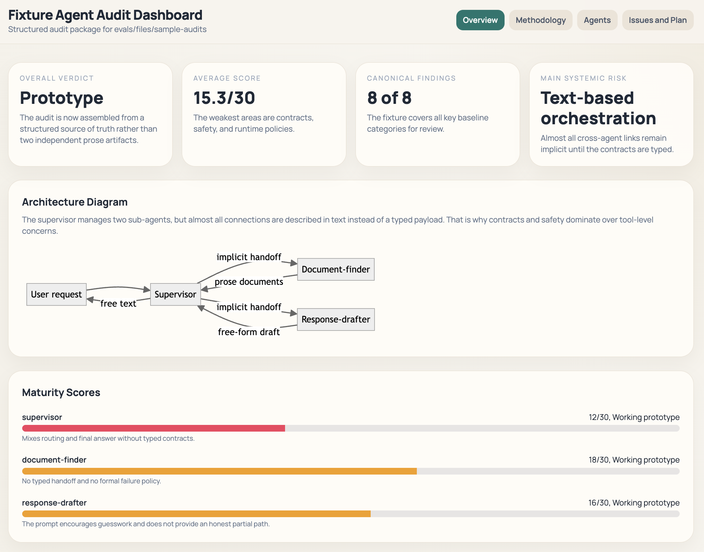

# roleframe

RoleFrame is a skill for designing and reviewing AI systems through IDEF0. It keeps the same Control vs Mechanism split, but the canonical object is now a **governance unit** with one of three profiles:

- `agent`, one business function
- `pack`, one ownership boundary with explicit routes and proof surfaces
- `workflow`, one orchestration contour that must be decomposed before audit

The intended deployment model is hybrid:

- the global core defines methodology, schemas, validators, and renderers
- a project-local profile maps the core onto local owner surfaces, proof surfaces, status vocabulary, write policy, and diagnostics placement

## What it does

RoleFrame has two public modes:

| Command | What it does |
|---|---|
| `/roleframe design [agent|pack|workflow] <description>` | Builds an implementation-ready design package under `docs/roleframe/design` |
| `/roleframe review [agent|pack|workflow] [path]` | Discovers artifacts and audits governance units under `docs/roleframe/review` |

If the profile is omitted, the skill autodetects it from the brief or discovered artifacts.

`dashboard.html` is generated automatically in both modes, but it stays a derived view, not the source of truth.



## Why use it

Many reviews stop at prompt wording. RoleFrame audits the full contract surface: prompt and policy, runtime and adapters, manifests, tests, proof surfaces, rollout signals, and typed contracts.

That makes it useful for:

- new unit design before implementation
- donor skill and donor pack intake
- cross-checking prompt text against executable or proof artifacts
- reducing hidden contradictions between routes, runtime, docs, and rollout state

## Method assumptions

RoleFrame keeps the same core:

- IDEF0 remains the requirement frame
- prompt and policy artifacts remain `Control`
- tools, adapters, runtime, memory, and manifests remain `Mechanism`
- JSON-first artifacts remain canonical

What changed in `v0.4.1`:

- the canonical unit is no longer agent-only
- `prompt archaeology` is now an `agent`-profile review tool, not the default for every system
- canonical package roots moved to `docs/roleframe/design` and `docs/roleframe/review`

## Repository layout

```text
roleframe/
├── SKILL.md
├── README.md
├── assets/        # dashboard template
├── docs/          # methodology references and preview assets
├── references/    # schemas, templates, anti-patterns, playbooks
├── evals/         # eval cases, fixtures, generated docs
└── scripts/       # validation, rendering, and eval helpers
```

## Canonical artifacts

Design packages:

- `docs/roleframe/design/NN_name.design.json`
- `docs/roleframe/design/summary.design.json`
- derived views next to them: `NN_name.md`, `README.md`, `dashboard.html`

Review packages:

- `docs/roleframe/review/NN_name.audit.json`
- `docs/roleframe/review/summary.audit.json`
- derived views next to them: `NN_name.md`, `README.md`, `dashboard.html`

Legacy `docs/agent_design` and `docs/agent_audit` are read-only compatibility roots. New canonical output should not be generated there.

Project-local profiles may project review outputs into repo diagnostics surfaces such as `output/diagnostics/<date>_packframe/`, but the review package remains derived. Only accepted structural facts should be promoted back into manifests, docs, or tests.

## Eval workflow

`evals/evals.json` is the source of truth. The markdown files in `evals/` are generated from it.

Typical loop:

```bash
UV_CACHE_DIR=.cache/uv XDG_DATA_HOME=.cache/uv-data XDG_BIN_HOME=.cache/uv-bin \
  uv run scripts/validate_skill.py --skip-skills-ref

UV_CACHE_DIR=.cache/uv XDG_DATA_HOME=.cache/uv-data XDG_BIN_HOME=.cache/uv-bin \
  uv run scripts/render_eval_docs.py

UV_CACHE_DIR=.cache/uv XDG_DATA_HOME=.cache/uv-data XDG_BIN_HOME=.cache/uv-bin \
  uv run scripts/prepare_eval.py --iteration 1 --wave 1

# run with-skill / without-skill sessions manually

UV_CACHE_DIR=.cache/uv XDG_DATA_HOME=.cache/uv-data XDG_BIN_HOME=.cache/uv-bin \
  uv run scripts/check_eval_artifacts.py --iteration-dir eval-workspace/iteration-1

UV_CACHE_DIR=.cache/uv XDG_DATA_HOME=.cache/uv-data XDG_BIN_HOME=.cache/uv-bin \
  uv run scripts/benchmark_eval.py --iteration-dir eval-workspace/iteration-1
```

Useful references:

- [`evals/review-dashboard-runbook.md`](evals/review-dashboard-runbook.md)
- [`evals/expected-findings.md`](evals/expected-findings.md)

## Validation

Run the official validator and local checks:

```bash
uvx --from git+https://github.com/agentskills/agentskills#subdirectory=skills-ref \
  skills-ref validate .

uv run scripts/validate_skill.py --skip-skills-ref
```

Local checks cover:

- frontmatter and package shape
- link integrity
- `evals/evals.json`
- generated eval docs
- structured design and review package schemas
- canonical artifact placement under `docs/roleframe/*`

Examples:

```bash
uv run scripts/render_roleframe_package.py --kind review --input evals/files/sample-audits --output /tmp/roleframe-review --check
uv run scripts/render_roleframe_package.py --kind design --input evals/files/sample-design-package --output /tmp/roleframe-design --check
```

## Release gate

`v0.4.1` is releasable only if:

- `skills-ref validate .` passes
- `uv run scripts/validate_skill.py` passes
- selected trigger and functional evals are green
- benchmark output exists for the current iteration
- generated outputs land in `docs/roleframe/*` and dashboards stay derived

## License

This repository uses [Apache-2.0](https://www.apache.org/licenses/LICENSE-2.0).
