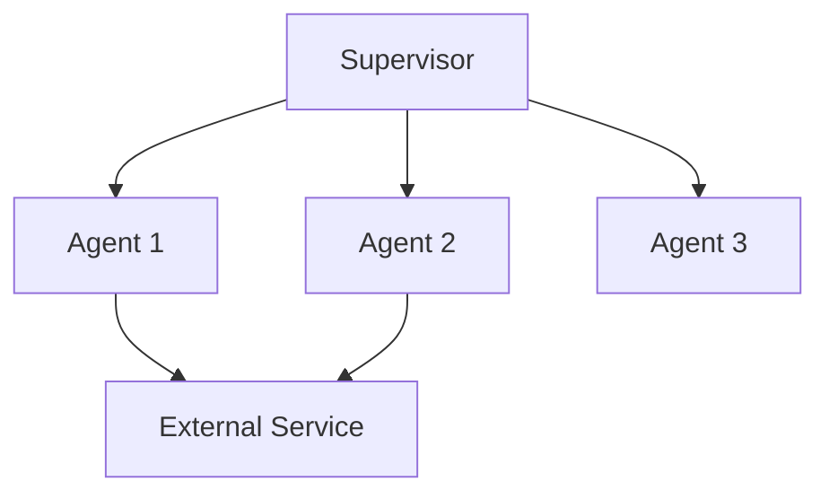

# Agent Passport Template

Use this template when generating agent passports in `design` mode.

## Template

```markdown
# Agent Passport: [Name]

**Version:** [X.Y]
**Date:** [YYYY-MM-DD]
**Owner:** [role/person]

## Business function

[One sentence: concrete action verb + input + output + consumer. NOT "helps with".]

## Consumer

[Who uses the agent's output: end user, another agent, API, system]

## In-scope

- [What the agent DOES -- specific, testable items]
- [...]

## Out-of-scope

- [What the agent does NOT do -- explicit exclusions]
- [Responsibilities of neighboring agents]
- [...]

## IDEF0 Card

| Component | Contents |
|---|---|
| **Input** | [What triggers the function: request types, files, events, dialog state] |
| **Control** | [Rules: role, SOP, constraints, output contract. THIS IS THE SKILL/PROMPT] |
| **Mechanism** | [Resources: tools, MCP servers, memory, LLM, runtime, middleware] |
| **Output** | [Result format + non-happy path behavior] |

## Output contract

### Happy path
[Exact format: JSON schema, markdown structure, or enum of response variants]

```json
{
  "status": "success",
  "result": { ... },
  "metadata": { "agent": "name", "confidence": 0.95 }
}
```

### Business-empty (no data)
[What the agent returns when there is no data to process. Must be a valid response, not an error.]

```json
{
  "status": "empty",
  "reason": "No matching records found for the given criteria",
  "suggestions": ["Broaden search terms", "Check date range"]
}
```

### Tool/MCP failure
[What the agent does when a tool is unavailable, times out, or returns an error. Must not hallucinate or silently fail.]

```json
{
  "status": "degraded",
  "reason": "Database tool unavailable (timeout after 30s)",
  "fallback_action": "Returning cached result from last successful query",
  "requires_retry": true
}
```

## Criticality

[Low / Medium / High] -- [Justification: what breaks if this agent fails?]

## Dependencies

| Depends on | Type | Failure impact |
|---|---|---|
| [tool/agent/service name] | [tool/sub-agent/MCP/API] | [What happens if unavailable] |

## Integration points

| Direction | Partner | Contract |
|---|---|---|
| Receives from | [supervisor / API / user] | [Input format] |
| Sends to | [consumer / next agent / UI] | [Output contract above] |
```

## Design decomposition template

When multiple agents are needed, use this to document the split:

```markdown
# Agent System: [System Name]

## Decomposition rationale

[Why one agent is not enough. What signals triggered the split.]

## Agent map



## Routing contract

| User intent pattern | Routes to | Confidence threshold |
|---|---|---|
| [Pattern description] | [Agent name] | [When to escalate vs route] |

## Boundary matrix

| Responsibility | Agent 1 | Agent 2 | Agent 3 |
|---|---|---|---|
| [Function A] | Owner | - | - |
| [Function B] | - | Owner | Consulted |
| [Function C] | - | - | Owner |
```
