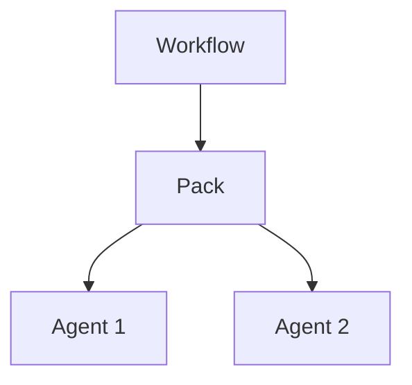

# Unit passport template

Use this template when generating design artifacts in `design` mode. The same frame works for `agent`, `pack`, and `workflow` profiles.

## Template

```markdown
# Unit passport: [Name]

**Profile:** [agent | pack | workflow]
**Version:** [X.Y]
**Date:** [YYYY-MM-DD]
**Owner:** [role / team / person]

## Boundary statement

[One sentence:
- agent -> verb + input + output + consumer
- pack -> ownership boundary + routes + owned surfaces
- workflow -> orchestration contour + decomposition rule + consumer
]

## Consumer

[Who uses the output: user, another unit, API, system]

## In scope

- [Specific responsibilities owned by this unit]

## Out of scope

- [Explicit exclusions]
- [Responsibilities of neighboring units]

## IDEF0 card

| Component | Contents |
|---|---|
| **Input** | [What triggers the unit: request, route, file, event, handoff] |
| **Control** | [Role, SOP, constraints, contract, decision rules] |
| **Mechanism** | [Tools, runtime, manifests, routes, memory, adapters, tests, proof surfaces] |
| **Output** | [Success, empty, failure, partial, delegation, rollout signal] |

## Contracts

### Input

```json
{ "...": "..." }
```

### Output

```json
{ "...": "..." }
```

### Failure

```json
{ "...": "..." }
```

## Governance

### Owner boundary

[What this unit owns and where that ownership stops]

### Routes

| Route | Consumer | Contract | Risk |
|---|---|---|---|
| [name] | [consumer] | [typed handoff or interface] | [main risk] |

### Owned surfaces

- [canonical surfaces owned by this unit]

### Proof surfaces

- [tests, contract checks, artifact checks, proofs]

### Deployment and rollout

- visibility: [visible / hidden / staged]
- rollout: [waves, gates, rollback condition]
- preparedness: [signals that make the unit safe enough to expose]
```

## Decomposition template

When one unit is not enough:

```markdown
# Unit set: [System name]

## Why decomposition is required

[Why one unit would be too broad or would violate ownership rules]

## Unit map



## Route matrix

| Source | Target | Typed contract | Owner |
|---|---|---|---|
| [unit] | [unit] | [schema / template] | [owning unit] |

## Boundary matrix

| Responsibility | Unit A | Unit B | Unit C |
|---|---|---|---|
| [ownership slice] | Owner | Consulted | - |
```
